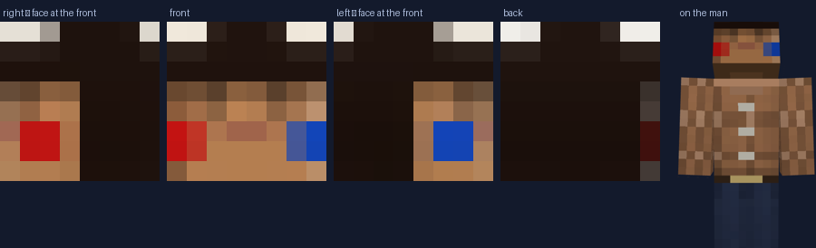

# FaceCraft (formerly KherveSkins) — working notes for Claude

## Do what was asked, without asking to

Everything asked for gets built in the session it is asked for. Standing
authorisation, every time.

- "Put it in the queue" means *do it this session*. A queue is an order of
  work, not a holding pen.
- **Do not stop to confirm.** Where a request could be read two ways, pick the
  reading a reasonable person meant, say which one in a sentence, and build
  it. A question that pauses the work costs more than a wrong guess, which is
  cheap to change once it exists and can be looked at.
- Never report something as done that is not. If part of a request was not
  built, say exactly which part and why, in the chat, without being asked.
- Big items go FIRST. A cheap fix that arrives while a large build is
  unfinished waits its turn.

## Always commit and push

At the end of every chat, commit the work. Group it into coherent commits —
one per feature or fix, `feat:` / `fix:` / `chore:` and a lowercase summary
that says what changed for the person using it. Work goes straight onto
`main`; no branches or PRs unless asked. Never commit `shots/`.

## What this is

A browser tool that turns a photograph into a Minecraft skin — the 64×64 PNG,
plus a live figure wearing it and an editor for both. **ES modules, Three.js
from a CDN, no build step and no npm.** Edit a file in `js/` and reload.
Python is only the dev server.

It has to work on **Windows and on Android from the same files**, which is
most of why it is a web app and all of why every control is pointer-events
and thumb-sized.

## Size

**Everything is written in sixty-fourths and multiplied.** `scaleOf(size)` is
the multiplier; 64, 128 and 256 are the sizes; nothing downstream hard-codes
64. The model's shape — where an arm hangs, how big a head is — stays in
sixty-fourths whatever the size, because he is the same man however finely he
is painted. Only the rectangles scale.

64 is the only size vanilla Java takes and is the default. The others are the
HD sizes, and they matter more than any of the cleverness below: at 256 a
face is thirty-two pixels across and the photograph carries the likeness by
itself. Two consequences worth remembering:

- **The texture is rebuilt with the figure**, not reused. A canvas that
  changes size under a Three texture does not reliably reach the card again;
  the geometry gets its new UVs, the picture stays the old one, and a 256
  skin renders as the same eight blocks it had at 64. That cost an hour.
- **The painter cannot draw texel by texel.** At 256 the dead-zone pass was
  sixty-five thousand canvas calls a redraw. The dead zones and the chequer
  are both stamped from cached images now, and the region lookup is a table
  (`regionMap`) rather than seventy-two rectangle comparisons per texel.

## The rule everything is built on

**At the size Minecraft actually takes, a face is eight pixels across.**

That one number decides the architecture. A photograph resized to 8×8 is a
beige smear with two grey dots in it — that is what a naïve version of this
program produces, and it is why most photo-to-skin tools look like nothing in
particular. Four things stop it, and none of them is optional:

1. **The warp** (`sampleFace`, `js/photo.js`). The eye line, the mouth line
   and both eye *columns* are pinned to whole texel centres before anything
   is averaged. An eye landing on the boundary between two texels is two
   half-eyes and reads as neither. This is the single highest-value thing in
   the codebase; the eye columns were added after a render showed a face with
   one eye and it was measured, not guessed.
2. **The detail pass** (`crisp`, `js/generate.js`). Averaging is precisely the
   operation that removes local contrast, so it is put back afterwards — on
   the 8×8, not on the photograph, because it is the small picture that has
   gone soft. It **must not overshoot**: clamped to the range of the
   neighbourhood, or the one dark texel beside a lit cheek becomes pure black
   and a black square on a face reads as a hole in the man.
3. **The nudge** (`emphasize`). The darkest texel in the eye row IS an eye,
   and is treated as one. Every colour it uses was found in that row of the
   photograph — it does not invent features, it commits to them.
4. **The de-background** (`dropBackground`). A head box is a rectangle and a
   head is not, so its corners are the wall. Found by flooding in from the
   EDGE — background is the stuff that touches the outside — and never
   allowed into the middle 4×4, because a grey-green eye against a grey wall
   is a closer colour match than an eye is to a cheek. It leaks if you skip
   it: the sides of the head are built from the front's edge column and the
   top from its first row, so one bad corner becomes a stripe down the ear.

## Finding the face

Two hard-won things, both found by looking at output rather than by reading
about faces:

**The eyes are HOLES.** The whites of eyes are never skin-coloured — the test
wants forty points of red over green and a sclera is neutral — so on any face
the two eyes are small enclosed gaps in an otherwise solid run of skin. Flood
the not-skin cells inward from the rim of the blob's box; what the flood
cannot reach is a hole; a pair of them at the same height and the right
distance apart is a face. Then the head follows from proportions that hold
across people (pupil distance ≈ 1/2.9 of head width, ≈ 1/4.25 of head
height, eye line halfway down). Within four pixels on every number, against a
reading off the skin's own edges that was out by a hundred and fifty.

**The colour rule has two holes in it** and both were found the same way.
Dark brown hair is the same colour as skin in chroma and differs only in
brightness — hence the value floor, and hence `splitByBrightness`, which asks
THIS head where its own light and dark halves divide (Otsu) rather than
imposing a threshold that would exclude somebody's complexion. A cream shirt
clears the standard chroma test by a whisker, and a portrait is mostly shirt
— hence `r - g > 12`, because skin has forty or fifty points of red over
green at any complexion and undyed cloth has six.

`fromBlob` is the old path, kept for closed eyes, sunglasses and heads turned
away. It is much worse and it is never nothing.

## The other load-bearing agreement

**The figure faces −Z, and his right hand is at +X.** `layout.js` and
`model.js` both depend on it. Get it backwards and everything still renders,
inside out, with his parting on the wrong side — the kind of wrong that
survives a dozen screenshots because nobody can say why it looks odd.

Two consequences in `setBoxUV` (`js/model.js`), both verified against renders
rather than reasoned about:

- The four upright faces take their rectangle as you would read it.
- The top and bottom are turned through **half a circle**, because Three
  unwraps a box as though it faced +Z. On the top face, image-up is the BACK
  of the head; on the bottom face, image-up is the FRONT. They are not the
  same, and that is correct.
- Neighbouring boxes overlap by **half a percent** (`WELD`). Minecraft's
  parts touch exactly, which is invisible against an opaque world and a
  hairline crack down the middle of him in the listing shot, which has no
  background at all.
- Every rectangle is inset by **a twentieth of a texel** (`BLEED`). Without
  it the far edge of a face samples exactly on the boundary and
  nearest-neighbour rounds INTO THE NEXT RECTANGLE — a dashed grey hem along
  one edge of a limb, invisible until you photograph the model against a
  colour that is not the page.

## The carve

`js/carve.js` is shape-from-silhouette, and it is the only photogrammetry
that belongs in this program: no model to download, no build step, nothing
about lenses, and its natural output is CUBES, which is what the destination
is made of. Four outlines, a block of space, and every cube that misses the
person in any one view is carved away.

Its limits are honest and worth knowing before trying to fix them. A hull is
the tightest shape the outlines allow and never tighter — it cannot see into
a dimple, and with four views the cross-sections are square, which is why a
45-degree view of the result looks boxier than the front. More views would
round it; nothing else will.

**Telling a person from a room is where nearly all the difficulty is**, and a
real capture — a real room, a real phone — breaks three ways that a clean test
room does not. All three were found by running actual photographs through it,
and each one on its own is enough to ruin the carve:

- **Exposure drift.** A phone re-meters between shots. A wall at 220 coming
  back at 190 differs by ninety across three channels, which IS the whole
  threshold — so on the darker frames the entire room registers as somebody
  standing in it. Measured on a real set: one shot in eight came back with
  **eighty-seven per cent of the picture marked as a person**. `exposureGain`
  measures the drift on a ring round the frame edge (room in both pictures,
  taken as a median so an elbow in the ring does not set the exposure) and
  corrects the plate before differencing.
- **Shadow.** The person throws one on the floor and it differs from the empty
  room, so without help it IS the person, and the outline grows a foot of
  floor — which then mis-scales every other view, since they are all scaled on
  the height of the outline. Told apart by CHROMATICITY: a shadow does not
  change what colour a wall is, only how much light comes off it. Measured on
  the test room, a shadow moves chromaticity by about five thousandths, a pale
  green shirt against a white door by fifty, bare skin by ninety. The line goes
  in the gap and the gap is wide.
- **Arms down**, which is what people actually do however clearly the card
  asks otherwise. Handled in `fit.js`: if the trunk is as wide as the whole
  silhouette at chest height the arms have fused, so they are placed by
  proportion — halves and quarters, as the model itself is — and the app SAYS
  it guessed.

And the thing that makes all of this debuggable rather than mystifying: **the
shot thumbnails show the silhouette**, room dimmed and person lit. A capture
that has gone wrong is invisible in the photograph and obvious the moment you
see what was taken to be a person.

**Which way the camera is, in the volume's own axes, is (−sin a, 0, −cos a) —
both signs negative.** `paint` gives each surface cube the colour of the camera
most nearly looking AT it, so an x-sign that is wrong hands every cube on his
left the colour of the camera pointed at his right, and the figure comes back
with its two sides swapped. Nothing symmetrical can show it, which is why it
stood for as long as it did.

It is settled by measurement, not by argument. `tools/make_test_room9.py
--mark` paints his right arm red and his left blue; in the FRONT photograph the
red one lands on the LEFT of the frame, which is what "his right" means and
needs no convention to state. At 90° only the red arm is visible. So 90° sees
his right side, which is the low end of x, which is (−1, 0, 0). Counted over
the marked head: **248 marker cubes on the correct side and 8 wrong with the
right sign; 67 right and 105 wrong with the old one** — worse than a coin.

**The MEDIAN is for the scale; the crown row is per view.** The first half of
this rule was learned early: a view allowed to set its own scale stretches its
whole projection and slices the volume to ribbons, so every view shares the
median height. The second half was learned from a real capture: a handheld
phone BOBS between shots, so the head is at a different height in every frame
— anchor every view to one shared crown row and each carves its copy of the
person a few cubes above or below the others', and the intersection loses the
crown in steps. Measured on a portrait set bobbing ±18px: 959 cubes gone.
Each view anchors on its own `sil.y`, clamped to the median ± a sixth of the
height so one outline that caught something overhead cannot drag its view off
the person.

**`paint` must never sample the room.** A cube's centre can overhang the
outline — the hull is a cube-sized approximation — and near the crown it
usually does, so sampling wherever the projection lands scattered 167
wall-coloured chips across the top of the bobbing test head. The sample point
is walked toward the middle of the person until it lands on them, plus two
steps for the blurred edge; if the best-facing camera cannot be seated the
next one is asked. And one cube covers scale-by-scale PIXELS, so it averages
the patch it covers (person pixels only) rather than carrying one pixel's
noise — which is what the static of vertical stripes on every surface was.

**A hole inside an outline is always a mistake.** A person is opaque; a shiny
forehead that matched the wall, glasses, a dark eye on a dark doorway — each
leaves a hole, and each hole is a tunnel bored through the volume, because
the carve trusts every view. `fillHoles` floods the empty pixels in from the
frame edge and fills whatever it cannot reach. The one price: a genuine
window through the person (a hand on a hip) fills too, which is why the
guidance asks for arms a little clear rather than akimbo.

**Normalise every view on the MEDIAN height, not on its own.** The camera did
not move and the person did not grow, so they are the same height in every
shot; any disagreement is an outline that caught a shadow or lost a foot. A
view allowed to set its own scale has its whole projection stretched by a
fifth, which slices the volume to ribbons — the symptom is a carve that comes
out as a cloud of chips rather than a person. With the median, one bad turn
out of eight costs a little accuracy and nothing else, which is measurable:
the same set with one shot deliberately taken from further back carves to the
same neck, hip and floor, to the cube.

**The capture is a BAG of photographs, not a list of slots.** One plate, then
as many turns as somebody cares to take, in any number — `js/turns.js` works
out what angle each one is. Three facts do it: they are in the order they were
taken (a phone names files that way, so a natural sort recovers the sequence,
and the angles are that sequence spread evenly round a circle); the front is
found by taking the WIDE axis first (a body is wider across than deep, which
rules out the profiles) and then the end of it with more skin in the head band
(a face rather than the back of a head); and the direction, which barely shows
in a silhouette at all, is a fixed default unless the evidence is decisive —
because a guess that is right half the time returns a mirror image half the
time, and one toggle fixes it either way.

Verified at 4, 5, 10 and 20 photographs, handed in starting from the back:
every angle recovered exactly, direction included.

**Everything that looks for a body part looks for a SHAPE, never for a
fraction of the frame.** This is the rule the capture kept breaking, in three
places, and all three failed on the same photographs: a head-and-shoulders
portrait, which is what somebody hands the program when they want a FACE.

- `headOf` took "the narrowest row in the top third" for the neck. In a
  standing figure the neck is an eighth of the way down; in a portrait it is
  halfway, and the search never reached it. Now `neckRow` walks down and takes
  the first row much narrower than the widest thing above it that widens again
  below — a pinch, wherever it sits. It lands at an eighth on a standing figure
  and a half on a portrait, and it cannot run on to the waist or to the gap
  between the ankles, because the neck comes first.
- `faceScore` counted skin over "the top sixth of the outline". On a portrait
  that is scalp; on somebody with their hair up it is the bun. The score was
  hair either way and the offset was rounding error — and the offset is what
  decides WHICH WAY the person turned, so the answer was a mirror image of them
  chosen by noise. It now measures inside the head band, over the lower
  two-thirds of it, which is eyes to chin at any framing.
- The direction is only accumulated from views with real skin in them
  (`score >= 0.08`). A view with four skin pixels has an offset, and the offset
  is wherever those four pixels fell.

**And a row's width is its outline edge to edge, never its pixel count.** A
mask is never solid — a dark eye against a dark doorway, a shadow under a chin,
a pair of glasses, any of them come out as room and leave a hole. Counted, a
row with two eyes punched out of it is narrow, and narrow is what a neck looks
like. Measured edge to edge a hole changes nothing. The symptom: three views of
a figure reporting a head thirty pixels tall and the other five reporting a
hundred and twenty, and the three were exactly the ones with eyes in them.

**The program works out the FRAMING and acts on it.** A standing figure is
seven heads tall so its head is an eighth of the outline; a portrait is a third
or more. Past a quarter there is no body in the photograph, "just the head"
ticks itself, and it says so — because the alternative is a Minecraft man whose
legs were measured off a chin. Touch the box and it stops guessing.

**A plate of a different shape is not a plate.** Every pixel is compared with
the wrong pixel, the whole frame comes back as a person, and the carve is a
solid block with nothing on screen to say why. One line to catch, and it cost
an hour of believing a bug that was a stale file.

**A video is the capture flow at thirty frames a second** — `addVideo` in
`js/app.js`. The opening frame is the plate (unless one is on file), the rest
are turns, and two filters pick the stills: empty frames go, and a still is
kept only when the outline has CHANGED since the last one kept (symmetric
difference over union, above 4.5%). The second filter is what makes the
even-spread angle assumption survive a person who pauses — kept frames space
themselves by TURN, not by clock, so ten seconds of standing still costs
nothing. Verified on a synthesised webm of the eight portrait poses held a
second each: exactly eight stills kept of thirty, every angle exact, and the
same cubes as the photo path to within one per cent. Two traps in the
synthesis: rAF never fires in a hidden pane, so the recording is driven by
`captureStream(0)` + `requestFrame()` on a timeout loop; and a MediaRecorder
blob reports Infinity for its duration until pushed to its end.

One honest limit, stated in the UI: the pile is read as ONE long turn, so a
second video must carry on from where the last stopped, not start the circle
again. Live camera (getUserMedia) needs a secure origin and a home http
server is not one — the recording is the same pixels, retakeable.

**Four turns is the minimum and eight is the point.** With four, every
cross-section of the hull is a square, so shoulders come out with corners on
them — visible the moment you turn it 45 degrees. Past seven views a cube is
allowed to miss ONE and still be kept, because by then the outlines outnumber
the mistakes.

Three more things that cost time and would cost it again:

- **`mw`/`mh` are the picture, `x/y/w/h` are the person in it.** Spreading
  the bounding box over the mask's own `w`/`h` made every projection read the
  wrong row, silently, and the carve returned zero cubes with no error.
- **Line the views up on the HEAD, not on the outline's middle.** A person
  turning on the spot keeps their head over the axis; their silhouette centre
  moves, because a shoulder is wider than a chest.
- **`tidy` is not cosmetic.** A stray pixel in one outline pokes a hole
  through a chest and a stray pixel the other way leaves a cube hanging
  beside an ear; both read as the carve having failed when it mostly worked.
  Fill anything with company on five sides, drop anything with company on
  fewer than two.
- **A symmetrical fixture cannot test which way round anything is.** The test
  head was a full-width skin box under a hair cap, so its two profiles were
  identical and every left-right check quietly passed — through a swapped
  camera normal and two reversed profile squares. It is now a proper head: the
  face is skin, the back of it is hair, and the boundary between them is worked
  out from the projection rather than faked per angle. `--mark` paints his
  right arm red and his left blue; `--portrait` reframes to head and shoulders,
  puts the hair up in a bun and marks the cheeks. Between them, every claim
  above is a number rather than an opinion.
- **A test figure must be a rigid 3D OBJECT.** The room figure was drawn
  per-angle, which is not the projection of anything — with four views the
  inconsistency hid in the slack and with twenty it carved the legs clean off,
  and for a while that looked like a bug in the program. It is now a set of
  upright elliptical columns at fixed places, projected properly. A test
  object that is not a real object cannot test a method that reconstructs
  real objects.
- **Feet together breaks the hip** the same way arms-down breaks the trunk.
  The fork-finding loop has to scan up from the floor and only accept a
  closing fork after it has SEEN one, or a person standing with their feet
  together gets their hips reported at their ankles.
- **An arm that does not touch the body is a separate blob**, and
  `keepLargest` will bin it. Real arms attach at the shoulder so this is fine
  in practice — but it is why the test generator draws a yoke, and it is the
  reason the guidance asks for daylight at the ribs and not at the shoulder.

## The head is not a carving problem

`js/faces3d.js`, and the tick box on the 3D card that turns it on. Two
separate claims, and the second is the one worth remembering.

**Carving a head alone is worth doing.** The same photographs and the same
plate, with each outline cut at the neck by `headOf` — a crown-to-neck band
found by the width pinch under the skull — and the block of space is then a
head's worth rather than a person's. It is the same code with a different
extent, so nothing else in the flow changes. Measured on the twenty-turn
room, the same photographs give **21,040 cubes for the head against 2,136 for
the whole body**: not more information, all of it spent on the part anybody
looks at.

**But a carve should not be in the path to a face at all.** A visual hull
answers a question about SHAPE, and a Minecraft head's shape is a fixed cube —
it was never in question. What lands on the skin is the colour of six flat
squares, so the sharpest possible answer is to take, for each square, the
photograph shot most nearly from that direction and sample it straight in.
Going through the hull instead averages the photographs into cubes and then
the cubes into texels, and every averaging is a blur a sixteen-pixel face
cannot spare. So the hull is still built — it is what you spin, and it is how
the head's own proportions are known — and `facesFromViews` ignores it.

**Every square reads exactly the way a photograph of it reads — no flips,
and that is what the Minecraft unfold IS.** Each square of the skin is its
face seen from OUTSIDE the cube, and a photograph taken square-on to a face
is precisely that view. Measured on the model with painted columns: the
right square runs back-of-head at u=0 to nose at the last texel, the left
square nose-first — and a 90° photo puts the nose at the image's right, a
270° photo at its left. Texel for texel, the raw sample is right.

That measurement exists because the opposite was shipped twice. A flip was
added here on the strength of fit.js's own axis comment and a dump of the
flat texture, and it put every profile's face round the back of the ear —
the player saw it on their own head before any test did. fit.js's side
faces had in fact been mirrored since the day they were written, invisible
because a torso's sides are one colour. Hence the rule, now load-bearing:
**an orientation is verified on the MODEL, never on the texture** — paint
one column red, render the cube, look. A flat dump cannot say which way a
square will be read, and neither can a comment.

One trap in taking that render: the head follows the pointer, so zero the
head joint's rotation first or the photograph is of a head turned to look
at something else, and the verdict is noise.

The parts of that which cost time:

- **`apart(a, b)` must return NOUGHT for equal angles.** Written the other way
  round, every square took the photograph from the opposite side and the back
  of the head came back with a face on it, which looks like a UV bug and is
  not.
- **Size the head box off the BAND, never off a ratio.** `w = h * 0.78` reaches
  past the ears and each square came back with a stripe of wall down both
  sides. The band already knows its own width, per view — and it should, since
  a head is wider from the front than in profile and that is the whole reason
  for taking both.
- **One HEIGHT for every square, each view's own WIDTH.** A hairline that steps
  half a texel between the front of the head and its side reads as a crack.
- **Inset a hair all round.** An outline is a pixel or two generous at its
  edge — the blur where hair meets wall belongs to neither — and on a
  sixteen-wide face two pixels is a whole texel of wall.
- **The head-only path writes through `noteEdit`, not through the skin.**
  Those texels are somebody's deliberate work and have to survive every later
  rebuild exactly as a brush stroke does. It is also what keeps the body's
  photograph, clothes and colours: the head path never touches them.
- **The top and the underneath come from the squares already painted** — the
  crown off the back's top row, the jaw off the front's bottom row — because
  nobody photographs the top of their own head, and a colour invented from
  nothing belongs to a different person in a different light.

`js/fit.js` maps the carve onto the model, and the fact it exists to deal
with is that **a person is seven and a half heads tall and a Minecraft man is
four**. So the mapping is anatomical, not a scale: find the neck, the hips
and the floor and pin them to the joins between the boxes — the same trick as
the eye line, one ring out.

Two mistakes already made there, both of which produce a figure that renders
happily and is wrong:

- **Every part needs its OWN box of cubes.** One scale for the whole figure
  cannot work: the model's head is as wide as its chest and a real head is
  half as wide, so a head box sized off the torso reaches past the ears and
  samples nothing.
- **Count the leg-split within the TRUNK's columns.** Arms held clear of the
  sides make three runs across a slice from shoulder to wrist, so "how many
  runs" answers three long before it answers two, and puts the hips in the
  ribs.

`python tools/make_test_room9.py` is the one that matters, because it is the
unkind test: a room with a door and a shelf in it, a shadow on the floor, arms
down, and **every shot metered differently**. Truth is crown y=300, feet
y=1180, so in the 900-tall working copy the silhouette should be y=202, h=591
in all eight. Before the fixes one shot came back at 87% of frame; after them
all eight land on 202/591 exactly. If any of them drifts, that is a
regression.

`python tools/make_test_turns.py` draws the four views plus the empty room,
of a figure whose neck, hips and floor are known. The carve should land on
16 / 45 / 71 of 72 cubes. If it drifts, that is a regression however good the
render looks.

## The wardrobe

`js/wardrobe.js` is a hundred and twenty-five items across nine categories,
and **not one of them is stored**. Every item is a function that paints in
FRACTIONS of the part it is on, so the same wardrobe fits a 64 and a 256
without a second set of numbers, and takes whatever colour it is handed.

The thing that makes it cheap is that Minecraft's two layers ARE a wardrobe's
layers: the base is the person and what is against their skin (hair, shirt,
trousers, a beard), the outer is what goes over it (a jacket, a hat, glasses,
a pack). So a hat covers hair by being on the head's overlay, and taking it
off reveals the hair rather than a hole. Nothing needed a third layer, which
is just as well.

Two rules that are easy to get wrong:

- **Order is the order a person dresses in.** `CATEGORIES` is that order —
  tops before outerwear, hair before hats, face last. Anything drawing on the
  outer layer draws after everything on the skin under it.
- **A chosen haircut must REPLACE the built-in one.** `bareHead` paints the
  photograph's hair out first. Without it "Shaved" is not shaved and every
  style in the grid looks identical, because underneath it is.

`js/cloth.js` is what makes a garment look like a garment rather than a
colour swatch, and it is four things, each one line of arithmetic: the WEAVE
(denim streaks, knit grain, leather speckle, a bright band down metal), the
LIGHT (darker at the hem than the shoulder, and a torso curves away at its
sides), the PRINT (stripes and plaid are a second COLOUR, not a shade of the
first, because that is what dye does) and the EDGES (a hem, a cuff, a collar
and a seam are one line of pixels each, and are most of what tells a jumper
from a t-shirt at forty pixels).

Hair gets the same treatment under a different name: vertical strands of two
or three tones, a highlight at the crown, roots a shade darker than the ends.
Without it every dark haircut is the same brown hat.

`js/doll.js` draws the thumbnails, and the head is drawn as a BOX rather than
a square on purpose: a bob and a crew cut have the same front face, and a cap
and a beanie have the same band — what separates them is the sides and the
top. Drawn flat, half the wardrobe is twenty identical brown rectangles,
which is exactly what the first version of that grid looked like.

Two traps in the rack UI, both found the hard way:

- **`fillGrid` runs before the grid is in the document**, so guarding the
  chunked loader with `grid.isConnected` stops it after the first five
  pictures. It is guarded with a token instead — which answers the question
  actually being asked, "is this still the fill that grid wants".
- **Whatever would COVER the thing being chosen comes off first.** A hood is
  outerwear and it sits on the head, so a coat left on turns fifty haircuts
  into fifty identical hoods.

## The body, not just the head

`photoClothes` samples the torso, the arms and the legs out of the photograph
the same way the face is sampled, and lays them OVER the plain clothes drawn
first. Over, not instead of: `sampleRect` reports how much of each rectangle
was actually inside the picture, and anything under four fifths is left alone
— so a head-and-shoulders shot gets a real shirt and invented trousers rather
than a shirt and a grey smear off the bottom edge.

The frame for it is `bodyFrame`, in head-heights, because a head is the only
ruler available. It is a guess, and it is wrong for a child and for a
photograph taken from below, which is why it wants to become a box on screen
like the head's.

## Painting must outlive the generator

Every slider re-runs `generate()` over the whole 64×64. A face somebody spent
five minutes fixing must not be wiped out because they nudged the contrast
afterwards. `S.edits` in `js/app.js` is that promise: a map of every texel
laid by hand, replayed after every rebuild. The painter reports writes
through `onWrite`, and its undo snapshots the map alongside the pixels — undo
that restored the image but not the record would put the paint straight back
on the next slider move.

Anything new that writes to the skin by hand has to go through the painter,
or it will not survive.

## Verifying a change

`window` carries the test hooks. Drive those and read the picture rather than
asking anybody to look:

| hook | what it does |
| --- | --- |
| `__load(url)` | load a photograph and build from it |
| `__state()` | frame, options, palette, how many texels were painted |
| `__render(yaw, pitch, dist)` | draw ONE frame on demand |
| `__fit()` | re-size the canvases — a headless browser fires no animation frames, so the ResizeObserver never runs and the canvas stays 1px wide |
| `__texel(x, y)` | read the image |
| `__size(n)` | change the resolution, or ask what it is |
| `__wear(cat, id)` | put something on, or ask what is on |
| `__render(...)` | draws one frame — and aims his head, exactly as the loop does |
| `__openCat(key)` | open one rack of the wardrobe, or go back to the list |
| `__shot(key, url)` | hand the capture one of its five photographs |
| `__build()` | carve, and say how many cubes survived |
| `__toMc()` | turn the carve into a skin, or the head onto the man |
| `__faceOnly(on)` | the just-the-head tick box |
| `__cap` | the shots, the volume and the voxel mesh |
| `__paint(x, y, hex)` | lay one texel exactly as a click would |
| `capture(name)` | POST the render to `shots/NAME.png` |
| `captureSkin(name)` | POST the 64×64 itself |
| `__gfx` | the renderer, scene and camera, for a camera the orbit cannot reach |

`python tools/make_test_face.py` draws two portraits with their head box, eye
line and mouth line PRINTED, so a check can compare what the finder said with
where they actually are. They are rulers, not photographs.

- `shots/test-face.png` — the plain one.
- `shots/test-room.png` — **the hard one**: a pale room and a pale top, which
  is the case that caught two versions out. A white wall is nearer to a pale
  forehead than a shadowed cheek is, and a cream shirt reads as skin.

Both should land within four pixels on the box and on the nose for the eye
line, the mouth line and both eye columns. If one of them drifts, that is a
regression however good the render looks.

**Read the texels before believing a screenshot.** A dump of the 8×8 face
settles in one call what a dozen camera angles argue about. And a render
against a colour that is not the page background is the only way to see a
hole in the model.

Serve on a port of your own (`python serve.py --port 8150`) rather than one
somebody is using.

## What is not built

- **No second figure to compare against.** Judging a skin means judging it
  next to another one, and there is nowhere to put a reference.
- **Nothing knows about capes, or Bedrock's extra geometry.** Classic and
  slim, and that is all.
- **The shelf is this browser's only.** `localStorage`, so a skin kept on the
  phone is not on the PC. `skins/` on the server is the shared half, and
  nothing syncs the two.
- **No batch.** One photograph at a time, and somebody selling a set of forty
  would want a folder in and a folder out.
