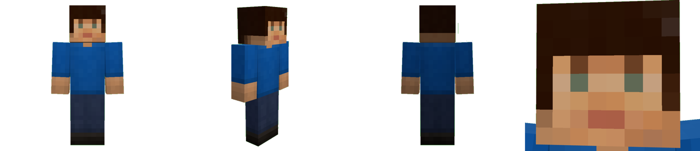
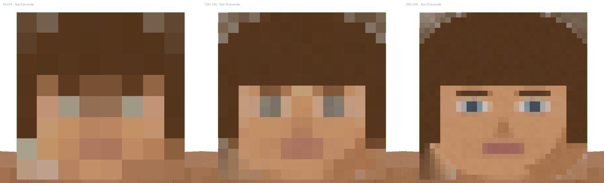

# KherveSkins

Turn a photograph into a Minecraft skin.

Show it a picture of somebody, and it hands you the 64×64 PNG Minecraft wants
— a whole character, front and back, hair, clothes and shoes — with a live
figure walking beside it so you can see what you are actually making. Then
adjust everything, or paint on it texel by texel.

One page of plain JavaScript. **No build step, no npm, nothing to install**,
and the same file runs on Windows and on Android.



## How many pixels

The one control that changes what the tool can do rather than what it makes.



At **64×64** a face is eight pixels across, and eight pixels is a suggestion
of somebody. It is also the only size vanilla Java Minecraft accepts, so it
is the default. **128** gives a sixteen-pixel face and **256** a
thirty-two-pixel one — brows, eyelids, lips, a hairline — and at those sizes
the photograph starts carrying the likeness by itself rather than leaning on
the tricks below.

128 and 256 are the HD skin sizes: Bedrock skin packs take them, and Java
does with an HD-skin mod. At either size the export offers a 64×64 as well,
averaged down rather than sampled, so there is always something to upload.

## Run it

**Windows** — double-click **Skin Maker.bat**, or:

```bash
python serve.py --open
```

Then <http://localhost:8140/>.

**Android** — start the server on your PC as above and open the address it
prints under `phone` (same wifi) in Chrome. Then **⋮ → Add to Home screen**
and it becomes an app: full screen, its own icon, and it keeps working with
the PC switched off, because everything it needs is cached the first time.

It is an ordinary static site, so any web host works too — put the folder
somewhere and it runs, with everything except *Save to skins/* (which needs
the little Python server to have somewhere to write).

## Using it

**Photo.** Choose a picture, take one with the phone's camera, paste one, or
drop one on the window. A head-and-shoulders shot looking at the camera gives
the best face.

It finds the head by itself and draws a box round it, with two dashed lines
across it and two pins on the eye line. **Those matter more than anything
else in the program.** A Minecraft face is eight pixels across, so an eye
landing between two of them is two half-eyes and reads as neither — the
sampler pins the eye line, the mouth line and both eyes onto whole texels
before it averages anything. When the automatic guess is wrong, drag them;
it takes a second and it is the difference between a face and a smudge.

**Face.** Which of the eight rows the eyes and the mouth sit on, and the tone
of the photograph — brightness, contrast, colour, warmth, sharpness. Also
*features*: how hard the eyes, the brow line and the mouth are drawn on top
of what was sampled. Every colour it uses was found in your photograph; what
the slider changes is how much it commits to them.

**Look.** How many pixels, and the five colours — hair, complexion, shirt, trousers, shoes — each
one labelled with where it came from. *Read off the photograph* means it was
measured. *Invented* means it was not in the picture at all, which is what
happens to trousers in a head-and-shoulders shot. Click one to choose it
yourself. Sleeve length, boot height, shading, grain, and hair as a layer of
its own standing proud of the skull.

**Paint.** The flat 64×64, every face outlined so you can tell an ear from a
hem. Brush, eraser, eyedropper, fill, lighten, darken; both layers or one;
undo and redo. **Mirror** paints the other side of the body at the same time
— the left arm lives twenty-eight rows away from the right one and faces the
other way, and doing that by hand is what makes people give up. You can also
turn on **paint on him** above the figure and click the model directly.

Painting survives the sliders. Move anything on any other tab and the face is
rebuilt underneath, with your work laid back on top.

**Save.** *Download* gives you the PNG. On a phone, *Share* hands it straight
to another app. *Listing picture* renders the figure big, on nothing, for
whatever you are selling it on. *Keep* puts it on this browser's shelf so an
unfinished face is still there tomorrow, and *Save to skins/* writes the PNG
and its settings into this folder — so a skin can be reopened in a month and
adjusted rather than started over.

### Getting it into Minecraft

- **Java** — minecraft.net → your profile → Skins → upload the PNG. Classic
  or slim must match the button in the top bar here.
- **Bedrock** (phone, console, Windows 10/11) — Dressing Room → Classic Skins
  → Owned → Import, and pick the PNG.

## How it works

Nine files, and each one has a job:

| file | what it knows |
| --- | --- |
| `js/layout.js` | the shape of a skin: which rectangle of the 64×64 is the back of his left calf |
| `js/pixels.js` | the image buffer, and colour arithmetic |
| `js/photo.js` | finding a head in a photograph, and squeezing part of one into a grid of texels |
| `js/generate.js` | the whole man: face, hair, the back of the head, and clothes |
| `js/model.js` | the figure in three dimensions, and the walk |
| `js/cropper.js` | the box, the two lines and the two pins |
| `js/paint.js` | the flat editor, and mirroring |
| `js/store.js` | the shelf, and every way out |
| `js/app.js` | what is wired to what |

The one thing worth understanding before changing anything: **at the size
Minecraft actually takes, a face is eight pixels across.** An ordinary resize
of a photograph to that is a beige smear with two grey dots in it, which is
why most photo-to-skin tools look like nothing in particular. Four things
stop it — the **warp**, which pins the eyes and the mouth to whole texels
before averaging; the **detail** pass, which puts back the local contrast
that averaging is precisely the operation for removing; the **nudge**, which
decides that the darkest texel in the eye row is an eye and treats it as one;
and the **wall**, because a head box is a rectangle and a head is not, so
what was behind the person is flooded out from the edge before it can leak
down the side of the head. Every one of them eases off as the size goes up.

The face-finder is worth a paragraph of its own, because the thing that made
it work was not a better colour rule. **The whites of eyes are never
skin-coloured** — so on any face, of any complexion, in any light, the two
eyes are two small holes punched in an otherwise solid run of skin. Find the
holes, and the rest of the head follows from proportions that hold across
people: the distance between the pupils is about a third of the width of a
head and a quarter of its height. Measured against a drawn portrait whose
true measurements were known, that lands within four pixels on every number
— where reading the head off the edges of the skin was out by a hundred and
fifty.

## Tools

`tools/make_icons.py` draws the app icons and `tools/make_test_face.py` draws
a stand-in portrait, so a check never needs a real person's photograph. Both
need Pillow; nothing else in the project needs anything.

## Selling them

The program is yours and so is what comes out of it. A real person's face is
not: a recognisable likeness of a living celebrity, *sold*, is a
publicity-rights problem nearly everywhere, however it was drawn. That is a
question about whose photograph you fed it, and it is yours to answer.
